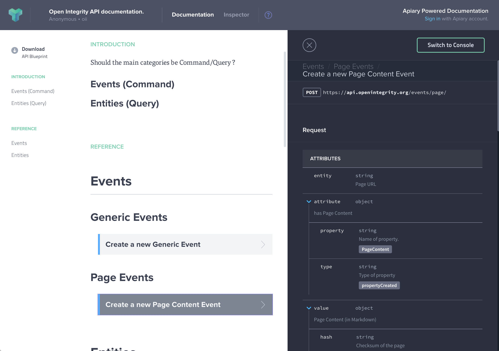

# Schema

The model should help describe the structure of all the measurements collected, it should also help propose evolution in partner data structures that will help broader interoperability.

## Api

> This should be moved into its own repo but for now the data modeling is intertwined with the api definition.

The `oii.apib` file generates : http://docs.oii.apiary.io/#

