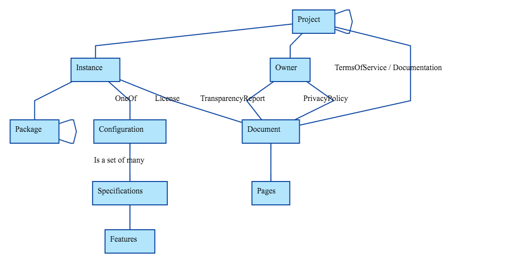

# Schema

The approach used is Linked Data Oriented. From an implementation's standpoint we don't yet use Linked Data because the cost of implementation for an MVP is too high. But we adopt data models and architectural patterns that will ease the migration towards Linked Data because of the following benefits:
    - Reuse modeling efforts done by others: allowing to cut down on the time required to develop a good data model, increasing the likely hood of our data being reused by existing systems.
    - Have very flexible and very expressive modeling capabilities: Helping to start with simple needed data model components and progressively complete the data model as needed.
    - Good fit for the problem at hand: Linked Data has been chosen by other projects to support decision making based on complex scientific data sets.

## Data Model

The 3 key entities in the data model are:
 - `Project`: Represents the name people use to refer to software. For example `signal` or `skype`.
 - `Instance`: A particular implementation for a given OS or audience. For example `signal-android` or `tom-skype`.
 - `Package`: A particular release of a software component such as `signal-android-3.9.0` or `openssl-1.0.0h`.

 

In order to model the fact that software might have different capabilities or properties depending on their configuration or the set of features used we use the following approach:
 - `Configuration`: A given `Package` can have any number of configurations. For example `telegram-endtoend` or `conversations-endtoend`.
 - `Specifications`: Configurations are defined by a set of specifications they implement. Such as `conversations-omemo` or `conversations-otr`. 

In order to model legal or policy documents, the `Document` entity will be used and allow statements/claims/terms to be added. `Page` refers to the actual text of the `Document`. A more detailed model which allows linking paragraphs to terms might be later adopted.
