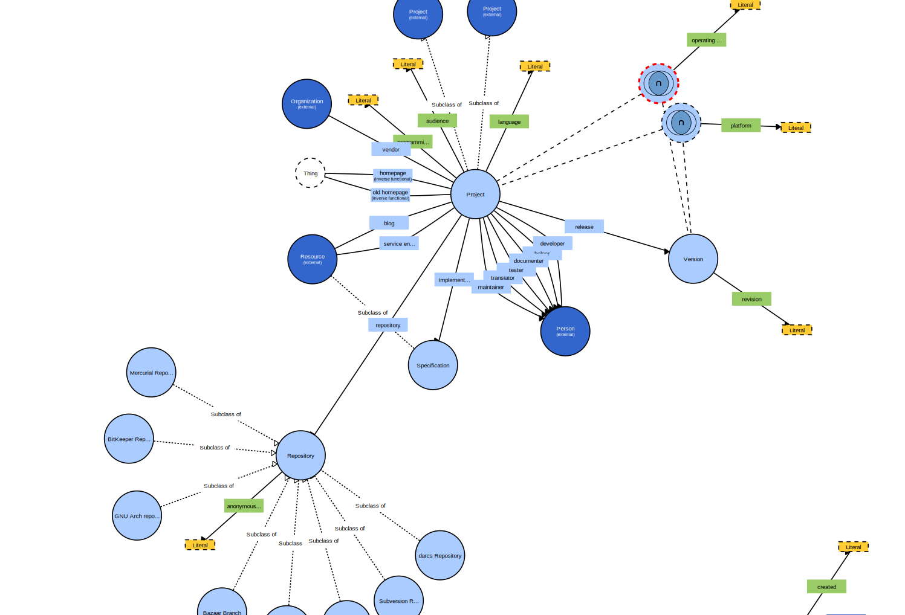
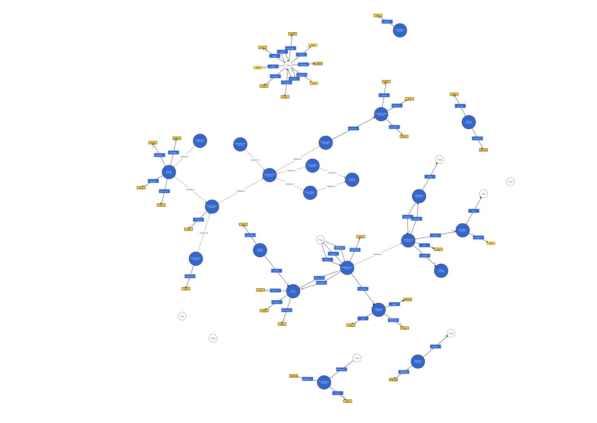

# Data Modeling Research

<!-- TOC depthFrom:2 depthTo:6 withLinks:1 updateOnSave:1 orderedList:0 -->

- [Analysis](#analysis)
- [Ontologies](#ontologies)
	- [DOAP](#doap)
	- [DBUG](#dbug)
	- [SPDX](#spdx)
- [Academic Papers](#academic-papers)

<!-- /TOC -->

## Analysis

From the point of view of Open Integrity's MVP goals:
 - The DOAP ontology offers some solid foundation to build on but is missing:
   - A concept of type of project components (frontend/backend)
   - A concept of project dependencies (libraries) - This should be
 - The DBUG ontology extends DOAP and offers a good way forward with issues.
   - It might be useful for a first approximation at CVEs.
 - SPDX brings the concept of `Package`s as `artifactOf` doap:`Project`s.
> A Package represents a collection of software files that are delivered as a single functional component. A package can contain sub-packages, but the information in this class is a reference to the entire contents of the package listed.

   - It also has `fileType`s : `archive`, `binary`, `source` and `other`.
   -

## Ontologies

### DOAP
 - Description of a Project
 - http://lov.okfn.org/dataset/lov/vocabs/doap

> Very relevant for the central elements of the Open Integrity data model around describing software projects. In particular:
>  ### Project
>    - `homepage` (Thing)- URL of a project's homepage, associated with exactly one project.
>
> > Should probably be a Resource/URI
>
>    - `vendor` (Organisation) - Vendor organization: commercial, free or otherwise
>    - `blog` (Resource) - URI of a blog related to a project
>    - `service endpoint` (Resource) - The URI of a web service endpoint where software as a service may be accessed
>    - `audience` (string) - Target user base
>
>> Could be made into a SKOS concept.
>
>    - `release` (Version) - A project release.
>    - `repository` (Repository) - Source code repository.
>    - `platform` (string) - Indicator of software platform (non-OS specific), e.g. Java, Firefox, ECMA CLR
>    - `operating system` (string) - Système d'exploitation auquel est limité le projet. Omettez cette propriété si le projet n'est pas limité à un système d'exploitation.
>
>> Both will become proper Classes.
>
>    - `programming language` (string) - Programming language a project is implemented in or intended for use with.
>    - `developers`, `tester`, `maintainer`, `translator`, `documenter`, `helper` (Person) - Various roles in the project.
>
> ### Version - Version information of a project release.
>
>  - `revision` (string) - Revision identifier of a software release.
>  - `platform` - See above.
>  - `operating system` - See above.
>
> ### Repository - Source code repository.
>
> Is a subclass of a number of type of version control systems.
> > Not sure about the ontology modeling choice.
>
>  - `anonymous root` (string) - Repository for anonymous access.
>
>> How nice :) Should probably be a `Resource`
>

### DBUG

http://lov.okfn.org/dataset/lov/vocabs/dbug

### SPDX

SPDX® is a designed to allow the exchange of data about software packages. This information includes general information about the package, licensing information about the package as a whole, a manifest of files contained in the package and licensing information related to the contained files.

> OII relevant classes and properties
>
> ### Package
>
> A `Package` represents a collection of software files that are delivered as a single functional component. A package can contain sub-packages, but the information in this class is a reference to the entire contents of the package listed.
>
>  - `hasFile` (File) - Indicates that a particular file belongs to a package.
>  - `versionInfo` (string) - Identify the version of the package.
>
>> Seems like it should be merged with doap:revision
>
>  - `artifactOf` (Project) - Indicates the project in which the SpdxElement originated. Tools must preserve doap:homepage and doap:name properties and the URI (if one is known) of doap:Project resources that are values of this property. All other properties of doap:Projects are not directly supported by SPDX and may be dropped when translating to or from some SPDX formats.
>  - `relationship` (Package) - Defines a relationship between two SPDX elements. The SPDX element may be a Package, File, or SpdxDocument.
> - `relationshipType` - Describes the type of relationship between two SPDX elements.
>
>> ### Relationship
>>
>> #### Lineage
>>
>> These relationship types describe some lineage between Packages or Projects.
>>
>
> - relationshipType_ancestorOf
> - relationshipType_descendantOf
>

>> #### Build Dependency
>
> - `relationshipType_staticLink` - Is to be used when SPDXRef-A statically links to SPDXRef-B.
> - `relationshipType_dynamicLink` - Is to be used when SPDXRef-A dynamically links to SPDXRef-B.
>

>> #### Runtime Dependency
>>
>> Some kind of package depedency
>>
> - `relationshipType_packageOf` - To be used when SPDXRef-A is used as a package as part of SPDXRef-B.
>
>> This seems to be the `children`/`parent` property we use.
>
>> Openssl is statically linked to Signal-Android.
>
>> These seem like more general dependency relations.
>
> - relationshipType_containedBy
> - relationshipType_contains
> - relationshipType_hasPrerequisite
> - relationshipType_prerequisiteFor
>
>> We could use prerequisites for system dependencies.
>
> - relationshipType_optionalComponentOf
> - relationshipType_other
>
>> #### Dev Dependency
>>
> - `relationshipType_buildToolOf`
>
>> Mudge's CyberITL recommends build tools that enable better security.
>
>> #### Other
>
> - relationshipType_amends
> - relationshipType_copyOf
> - relationshipType_dataFile
> - relationshipType_describedBy
> - relationshipType_describes

>> #### Documentation
>
> - relationshipType_documentation
> - relationshipType_metafileOf
> - relationshipType_testcaseOf
> - relationshipType_variantOf
>
>> #### Artifacts
>
> - relationshipType_distributionArtifact
>
>> For the GPL. Distribute sources.
>
> - relationshipType_generatedFrom
> - relationshipType_generates
>
>> Reproducible builds or Code Provenance.
>
>>
>> #### Files
>>
> - relationshipType_expandedFromArchive
> - relationshipType_fileAdded
> - relationshipType_fileDeleted
> - relationshipType_fileModified
> - relationshipType_patchApplied
> - relationshipType_patchFor
>
>> ### Licenses
>
>  - `licenseDeclared` (License) - A License represents a copyright license. The SPDX license list website is annotated with these properties (using RDFa) to allow license data published there to be easily processed. The license list is populated in accordance with the License List fields guidelines. These guidelines are not normative and may change over time. SPDX tooling should not rely on values in the license list conforming to the current guidelines.
>
> - `licenseConcluded` (License) - This field contains the license the SPDX file creator has concluded as governing the SPDX item or alternative values, if the governing license cannot be determined. The options to populate this field are limited to:
>   - (a) the SPDX License List short form identifier, if the Concluded License is on the SPDX License List;
>   - (b) a reference to the license text denoted by the LicenseRef-[idString], if the Concluded License is not on the SPDX License List;
>   - (c) NOASSERTION should be used if:
>     - (i) the SPDX file creator has attempted to but cannot reach a reasonable objective determination of the Concluded License;
>     - (ii) the SPDX file creator is uncomfortable concluding a license, despite some license information being available;
>     - (iii) the SPDX file creator has made no attempt to determine a Concluded License;
>     - (iv) the SPDX file creator has intentionally provided no information (no meaning should be implied by doing so); or
>     - (v) there is no licensing information from which to conclude a license for the package.
>  - With respect to (a) and (b) above, if there is more than one Concluded License, all should be included. If the package recipient has a choice of multiple licenses, then each of the choices should be recited as a "disjunctive" license. If the Concluded License is not the same as the Declared License, a written explanation should be provided in the Comments on License field (section 3.15). With respect to (c), a written explanation in the Comments on License field (section 3.15) is preferred.
>
>> There is a data verification model implied here that's relevant OII. Maybe `Declared`, `Concluded` (and below `Extracted`?) should be part of data provenance declaration and the conflict management model?
>
> - `hasExtractedLicensingInfo` (License) - Indicates that a particular ExtractedLicensingInfo was defined in the subject SpdxDocument.
>
> - `licenseInfoFromFiles` (License) - This field is to contain a list of all licenses found in the package. The relationship between licenses (i.e., conjunctive, disjunctive) is not specified in this field – it is simply a listing of all licenses found. The options to populate this list are limited to: (a) the SPDX License List short form identifier, if a detected license is on the SPDX License List; (b) a reference to the license, denoted by LicenseRef-[idString], if the detected license is not on the SPDX License List; (c) NONE, if no license information is detected in any of the files; or (d) NOASSERTION, if the SPDX file creator has not examined the contents of the actual files or if the SPDX file creator has intentionally provided no information (no meaning should be implied by doing so).
>
> ### File
>
> A File represents a named sequence of information that is contained in a software package.
> >
>  - `fileContributor` (string) - This field provides a place for the SPDX file creator to record file contributors. Contributors could include names of copyright holders and/or authors who may not be copyright holders yet contributed to the file content.
>  - `fileName` (string) - The name of the file relative to the root of the package.
>
> ### Snippet
>
> The set of bytes in a file. The name of the snippet is the name of the file appended with the byte range in parenthesis (ie: “./file/name(2145:5532)”)
>  - `byteRange` (string) - String of the form \d+:\d+ denoting a range of bytes.
>  - `fromFile` (File) - File containing the SPDX element (e.g. the file contaning a snippet).
>
>> This could be reused for the process of identifying code sections which are related to an issue.
>
> ### License
>
> A License represents a copyright license. The SPDX license list website is annotated with these properties (using RDFa) to allow license data published there to be easily processed. The license list is populated in accordance with the License List fields guidelines. These guidelines are not normative and may change over time. SPDX tooling should not rely on values in the license list conforming to the current guidelines.
>
> - `licenseText` (string) - Full text of the license.
> - `extractedText` (string) - Purpose: Provide a copy of the actual text of the license reference extracted from the package or file that is associated with the License Identifier Assigned to aid in future analysis.
>
>> Seems like another provenance/context related modeling aspect.
>
> - `licenseId` (string) - A human readable short form license identifier for a license. The license ID is either on the standard license list or the form "LicenseRef-"[idString] where [idString] is a unique string containing letters, numbers, ".", "-" or "+".
> - `isOsiApproved` (boolean) - Indicates if the OSI has approved the license.
>
>> Do we need to asbtract this? Who approves, authorises or certifies?
>
> - `standardLicenseTemplate` (string) - License template which describes sections of the license which can be varied. See License Template section of the specification for format information.
> - `standardLicenseHeader` (string) - License author's preferred text to indicated that a file is covered by the license.
>
>> Seems like both of the above could be used by a license text parser.
>
> ### PackageVerification
>
> - `packageVerificationCode` (PackageVerification) - This field provides an independently reproducible mechanism identifying specific contents of a package based on the actual files (except the SPDX file itself, if it is included in the package) that make up each package and that correlates to the data in this SPDX file. This identifier enables a recipient to determine if any file in the original package (that the analysis was done on) has been changed and permits inclusion of an SPDX file as part of a package. Algorithm:
>
>       verificationcode = 0
>       filelist = templist = “”
>       for all files in the package {
>         if file is an “excludes” file, skip it /* exclude SPDX analysis file(s) */
>         append templist with “SHA1(file)/n”
>       }
>       sort templist in ascending order by SHA1 value
>       filelist = templist with "/n"s removed. /* ordered sequence of SHA1 values with no separators */
>       verificationcode = SHA1(filelist)
> Where SHA1(file) applies a SHA1 algorithm on the contents of file and returns the result in lowercase hexadecimal digits. Required sort order: '0','1','2','3','4','5','6','7','8','9','a','b','c','d','e','f' (ASCII order)
>
> - `packageVerificationCodeValue` (hexBinary) - The actual package verification code as a hex encoded value.
> - `verificationCodeExcludedFile` (string) - A file that was excluded when calculating the package verification code. This is usually a file containing SPDX data regarding the package. If a package contains more than one SPDX file all SPDX files must be excluded from the package verification code. If this is not done it would be impossible to correctly calculate the verification codes in both files.
>
> #### Properties
> - `hasDownload` (anyURI) - This section identifies the download Universal Resource Locator (URL), or a specific location within a version control system (VCS) for the package at the time that the SPDX file was created. If there is no public (or internal) URL, then it is explicitly marked as NONE. If there is insufficient knowledge about whether a public or internal download mechanism exists or not, then NOASSERTION should be used.
>
>  Data Format: uniform resource locator | VCS location | “NONE” | “NOASSERTION” For version-controlled files, the VCS location syntax is similar to a URL and has the: `<vcs_tool>+<transport>://<host_name>[/<path_to_repository>][@<revision_tag_or_branch>][#<sub_path>]`
>
>  This VCS location compact notation (inspired and mostly adopted from https://pip.pypa.io/en/latest/reference/pip_install.html#vcs-support as of 20150220) supports referencing locations in version control systems such as Git, Mercurial, Subversion and Bazaar, and specifies the type of VCS tool using url prefixes: “git+”, “hg+”, “bzr+”, “svn+” and specific transport schemes such as SSH or HTTPS.
>
>  Specifying sub-paths, branch names, a commit hash, a revision or a tag name is recommended, and supported using the "@"delimiter for commits and the "#" delimiter for sub-paths. Using user names and password in the host_name is not supported and should be considered as an error. User access control to URLs or VCS repositories must be handled outside of an SPDX document. In VCS location compact notations, the trailing slashes in `<host_name>`, `<path_to_repository>` are not significant. Leading and trailing slashes in `<sub_path>` are not significant.

#### Libraries.io

 - type:
   - runtime
   - development

## Academic Papers

https://www.researchgate.net/publication/262398131_Open_data_framework_for_sustainable_assessment_in_software_forges
