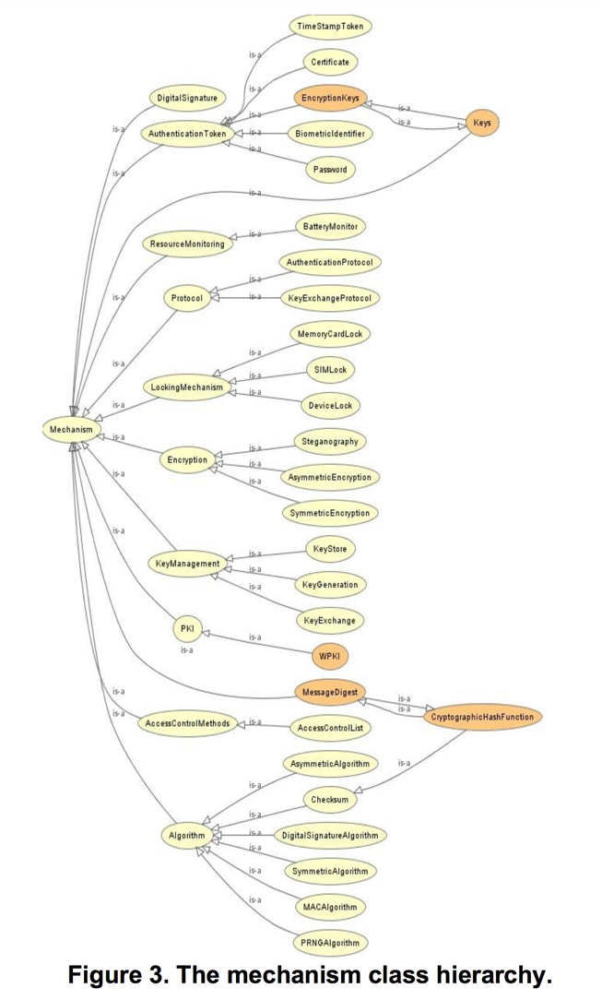
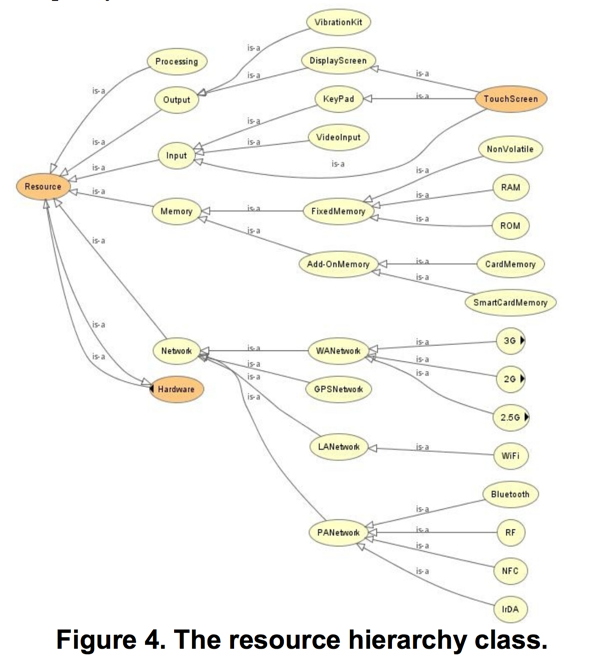

---

 - Test:
   - Test
   - Yo

---

# Security and Privacy Schema

## Definitions

 - **Feature**: High-level feature, which might express a security objective or privacy goal. It might also express what is generally meant in everyday language for instance *"it has a group-chat feature"*.
   - Security Features, Usability Properties and Adoption Properties in [SOKSECUREMESSAGING]
   - Security Property in STAC
   - Privacy Goal & Privacy Requirements in [ONTOPRIV]
 - **Mechanism**: A technical or policy solution providing a feature. This corresponds to:
   - Scheme as defined in [SOKSECUREMESSAGING]
   - Privacy Constraint, Privacy Mechanism or Privacy Policy in [ONTOPRIV]
   - Mechanism in [ONTOMOBILE]

   

 - **ResourceType**

   


```{viz}
digraph openintegrityschema {
  # rankdir=LR;
  ratio="0.5";
  size="12,12"
  clusterMode="global";
  edge [fontsize="10.0" labeldistance="20" labelangle="30"];
 	node [shape = "circle"];
  node [shape = "box" width="1.5"];
  SchemaNext, Mechanism [shape = "rect" width="1.5" style = "dashed" fontcolor="black"];
  Schema, Feature, Project, Instance, Configuration, Package, Issue, AuditDocument [shape = "box" width="1.5" style="bold"];
  Category, VulnerabilityType, AssetType, FeatureType, MechanismType, ThreatType, Specification, Policy, Protocol [shape = "oval" width="1.5"];

  subgraph cluster_0 {
    color=invis;
#    Intention
  }

  subgraph cluster_1 {
    color=invis;
    ThreatType
    AssetType
  }

  subgraph cluster_02 {
    color=invis;
    Issue
    AuditDocument
  }

  subgraph cluster_12 {
    color=invis;
    Project
    Instance
    Package
  }

  subgraph cluster_2 {
    color=invis;
    Configuration
    Feature
    Mechanism
    Specification
    Policy
    Protocol
  }

  graph [labelloc="b" fontsize="12.0" fontname="helvetica-bold"];

  subgraph cluster_4 {
    label="Legend";
    edge [color="invis"];
    Schema -> SchemaNext -> Category;
  }

  edge [fontsize="10.0" labeldistance="20" labelangle="30"];

  AssetType -> Project [ xlabel = "has a" dir = "back" ];

  ThreatType -> VulnerabilityType [ xlabel = "Exploits" ];
  VulnerabilityType -> AssetType [ xlabel = "Exists on" ];
  ThreatType -> AssetType [ xlabel = "Threatens" ];

  FeatureType -> Feature [ xlabel = "has type"];
  Feature -> Mechanism [ xlabel = "implemented via" ];
  VulnerabilityType -> Feature [ xlabel = "has type" dir = "back" ];
  VulnerabilityType -> Issue [ xlabel = "has type" dir = "back" ];
  Issue -> Feature [ xlabel = "addresses" ];
  AuditDocument -> Issue [ xlabel = "Reports"  ];
  Feature -> Package [ xlabel = "depends on" ];

  Project -> Instance
  Instance -> Package
  Instance -> Configuration [ xlabel = "has a" ];
  Package -> Mechanism [ xlabel = "implements" ];
  Configuration -> Feature [ xlabel = "provides" ];

  MechanismType -> Mechanism [ xlabel = "has type"];
  Mechanism -> Specification [ xlabel = "has type"];
  Mechanism -> Protocol [ xlabel = "has type"];
  Mechanism -> Policy [ xlabel = "has type"];
#  Intention -> Feature [ xlabel = "Enables" dir = "back" ];

}
```

## Background

 We [reviewed the literature](https://meta.openintegrity.org/store/schema/blob/master/modeling.md#software-security-privacy-ontologies) on security and privacy ontologies for requirements, modeling and other purposes. Are currently at the system boundary or out of scope: description of threats, attacks methods, impact, organisational aspects of risk management, endpoint security.

 From there we've identified key papers which provide relevant concepts. Specifically:
  - [ONTOPRIV] : Gharib, Mohamad, Paolo Giorgini, and John Mylopoulos. "Ontologies for Privacy Requirements Engineering: A Systematic Literature Review." arXiv preprint arXiv:1611.10097 (2016).
  - [SOKSECUREMESSAGING] : Unger, Nik, et al. "SoK: Secure Messaging." 2015 IEEE Symposium on Security and Privacy. IEEE, 2015.
  - [ONTOMOBILE] : Beji, Sofien, and Nabil El Kadhi. "Security ontology proposal for mobile applications." 2009 Tenth International Conference on Mobile Data Management: Systems, Services and Middleware. IEEE, 2009.

## Example

We'll evaluate the fitness of these modeling choices by aiming to fit the [SOKSECUREMESSAGING] paper's concept into this schema.

We depart from the papers above in the following ways:
 - [ONTOMOBILE] :
   - We consider the Mobile Profile as Features.


 - Signal `project` on Android `instance` with the default chat `configuration` seeks (forward secrecy `feature` via signal protocol `mechanism` implemented in libsignal `package`).


[SOKSECUREMESSAGING]:  http://cacr.uwaterloo.ca/techreports/2015/cacr2015-02.pdf
[ONTOPRIV]: https://arxiv.org/pdf/1611.10097.pdf
[ONTOMOBILE]: https://05d0e13c-a-62cb3a1a-s-sites.googlegroups.com/site/nabilelkadhi/Publications-overview/conferences/SecurityOntologyworldcomp.pdf?attachauth=ANoY7coRmXAkTYwVlQ9DGf5OPYIF_emhsS4w-1EW_rNmSDTkIskNIm9TbZMdC-FXhHNQyeclYsIpgnX3Yln-tV-daDJfTi-fjJg4_qNBhuxiwPIjEiuYhfeC5qfj5nTIk_350_USk5bPsoH4ymr18Sy1TMJc_JwCuF0V6gSsHFmO4aDRehb6HjMGhaQ2mLWPrxTWYWInzbzYjhoWRqmJzGNCbzsc52l3yooMnv_xw6yMXJySC0xr07X8f3FPT-UPI1U8Qx4gUgPJNxoKi_wSMKoIqTXEcYd3nQ%3D%3D&attredirects=0
