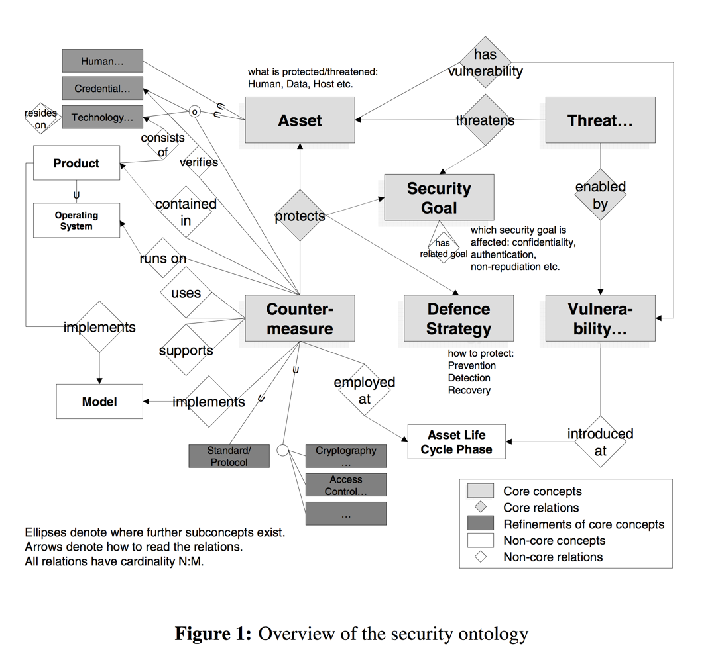

# Security and Privacy Schema

This proposed extension to our data layer schema (see the [README.md](README.md)) aims to help model statements about software tool seecurity and privacy properties in a simple accessible language with only a limited amount of domain knowledge required, for instance:

> The **Signal** `project` on it's **Signal Android** `instance` with the **default chat** `configuration` seeks to provide **forward secrecy** `feature` via the **signal protocol** `mechanism` implemented in **libsignal-2.4.0** `package`.

It focuses on facts or claims that are as objective as possible to enable more sophisticated, context-dependent metrics to be developed from these facts. These facts and the schema underlying them will also be debatable, but hopefully the most valuable debates can occur with the definition of Metrics that are useful for supporting decisions.

## Background

 We [reviewed the literature](https://meta.openintegrity.org/store/schema/blob/master/modeling.md#software-security-privacy-ontologies) on security and privacy ontologies for requirements, modeling and other purposes. Are currently at the system boundary or out of scope: description of threats, attacks methods, impact, organisational aspects of risk management, endpoint security.

 From there we've identified key papers which provide relevant concepts. Specifically:
  - [ONTOSEC]: A. Herzog, N. Shahmehri, C. Duma, An Ontology of Information Security, International Journal of Information Security and Privacy, 1(4):1-23, 2007.
  - [ONTOPRIV] : Gharib, Mohamad, Paolo Giorgini, and John Mylopoulos. "Ontologies for Privacy Requirements Engineering: A Systematic Literature Review." arXiv preprint arXiv:1611.10097 (2016).
  - [SOKSECUREMESSAGING] : Unger, Nik, et al. "SoK: Secure Messaging." 2015 IEEE Symposium on Security and Privacy. IEEE, 2015.
  - [ONTOMOBILE] : Beji, Sofien, and Nabil El Kadhi. "Security ontology proposal for mobile applications." 2009 Tenth International Conference on Mobile Data Management: Systems, Services and Middleware. IEEE, 2009.


## Proposed Definitions

 - `Feature`: High-level **capability** or **issue**, which might express a security objective or problem, a privacy goal.
   - `Feature`s depend on `Mechanism`s which are (for technology mechanisms) themselves
   - `Feature` exist in particular `Configuration`s.
 - Correspondances in literature:
   - Security Features, Usability Properties and Adoption Properties in [SOKSECUREMESSAGING]
   - Security Property in STAC
   - Privacy Goal & Privacy Requirements in [ONTOPRIV]
   - Counter Measure and Goal in [ONTOSEC]

> "This developer presents this security problem as a Feature."
> "The lack of privacy of this project is one of its features"

 - **Mechanism**: A technical or policy **component** providing a feature, or the **vulnerability** causing a problem.
   - Technology **Mechanism**s are implemented in **Package**s
   - Policy **Mechanism**s can be documented in **Document**s

 - Correspondances in literature:
   - A concrete instance of a Scheme as defined in [SOKSECUREMESSAGING]
   - Concrete instances of Privacy Constraint, Privacy Mechanism or Privacy Policy in [ONTOPRIV]
   - Concrete instances of Mechanisms in [ONTOMOBILE]

When Mechanisms are causing an Issue (i.e. they are Vulnerabilities) they have a VulnerabilityType (equivalent to a Weakness in CVE/CWE terminology). A Feature exists to address an actual `Issue` or a potential `Issue` (during the design phase, as part of a Threat Model).

|         | Feature    | Mechanism     |
|:--------|:-----------|:--------------|
|         | Capability | Component     |
| Negated | Issue      | Vulnerability |

> From different contexts some features can be seen as capabilities or issues (from the adversary standpoint for instance), in the context of Open Integrity focuses on the provision of security and privacy features, and therefore Features are first expressed as positive expression of Capabilities centered on users, and the assertion of a a negative feature is considered an issue. There might be cases where this isn't simple. This could lead to certain similar concepts existing simultaneously as posited assertions and negated assertions.

```plantuml
digraph openintegrityschema {
  # rankdir=LR;
  ratio="0.5";
  size="12,12"
  # clusterMode="global";
  edge [fontsize="10.0" labeldistance="20" labelangle="30"];
 	node [shape = "circle"];
  node [shape = "box" width="1.5"];
  Feature, Mechanism, Project, Instance, Configuration, Package [shape = "box" width="1.5" style="bold"];

  subgraph cluster_0 {
    color=invis;
#    Intention
  }


  subgraph cluster_2 {
    color=invis;
    Feature
    Mechanism
  }

  subgraph cluster_12 {
    color=invis;
    Project
    Instance
    Configuration
    Package
  }

  graph [labelloc="b" fontsize="12.0" fontname="helvetica-bold"];

#  subgraph cluster_4 {
#    label="Legend";
#    edge [color="invis"];
#    Schema -> SchemaNext -> Category;
#  }

  edge [fontsize="10.0" labeldistance="20" labelangle="30"];

  Feature -> Mechanism [ xlabel = "depends on" ];


  Project -> Instance [ xlabel = "develops" ]
  # Instance -> Package [ xlabel = "has" ];
  Instance -> Configuration [ xlabel = "is made of" ];
  Configuration -> Package [ xlabel = "depends on" ];
  Feature -> Configuration [ xlabel = "provides" dir = "back" ];
  Package -> Mechanism [ xlabel = "implements" ];


}
```


### Including Categories


```plantuml
digraph openintegrityschema {
  # rankdir=LR;
  ratio="0.5";
  # clusterMode="global";
  edge [fontsize="10.0" labeldistance="20" labelangle="30"];
 	node [shape = "circle"];
  node [shape = "box" width="1.5"];

  VulnerabilityType, AssetType, FeatureType, MechanismType, ThreatType, Specification, Policy, Protocol, UX, Security, Functional, Privacy [shape = "oval" width="1.5" style = "dashed"];

  #APIAbuse,ErrorHandling, CodeQuality, InputValidation,SecurityImplementation,TimeAndState,Environment [shape = "oval" width="1.5" style = "dashed"];

  Feature, Mechanism, Project, Instance, Configuration, Package [shape = "box" width="1.5" style="bold"];

  subgraph cluster_0 {
    color=invis;
#    Intention
#
  }

  subgraph cluster_12 {
    color=invis;
    Project
    Instance
    Configuration
    Package

  }
  subgraph cluster_2 {
    color=invis;


      subgraph cluster_12 {
        color=invis;
        UX
        Functional
        Security
        Privacy

      }

    FeatureType
    Feature
    Mechanism
    MechanismType

    subgraph cluster_1 {
      color=invis;
#      AssetType
      ThreatType
      VulnerabilityType
    }

  }


  graph [labelloc="b" fontsize="12.0" fontname="helvetica-bold"];

#  subgraph cluster_4 {
#    label="Legend";
#    edge [color="invis"];
#    Schema -> SchemaNext -> Category;
#  }

  edge [fontsize="10.0" labeldistance="20" labelangle="30"];

  Feature -> Mechanism [ xlabel = "depends on" ];

  Project -> Instance [ xlabel = "develops (1..n)" ]
  Instance -> Configuration [ xlabel = "has (1..n)" ];
  Configuration -> Package [ xlabel = "depends on" ];
  Configuration -> Feature [ xlabel = "provides" ];
  Package -> Mechanism [ xlabel = "implements" ];


  FeatureType -> Feature [ xlabel = "has type"];
  UX -> FeatureType [ xlabel = "is a" style = "dashed"];
  Security -> FeatureType [ xlabel = "is a" style = "dashed"];
  Privacy -> FeatureType [ xlabel = "is a" style = "dashed"];
  Functional -> FeatureType [ xlabel = "is a" style = "dashed"];

  Mechanism -> MechanismType  [ xlabel = "has type"];
  MechanismType -> Specification   [ xlabel = "is a" style = "dashed"];
  MechanismType -> Protocol [ xlabel = "is a" style = "dashed"];
  MechanismType -> Policy [ xlabel = "is a" style = "dashed"];

  ThreatType -> Feature [ xlabel = "can have" style = "dashed" dir = "back"];
  VulnerabilityType -> Mechanism [ xlabel = "can have" dir = "back" style = "dashed"];

  ThreatType -> VulnerabilityType [ xlabel = "exploits" style = "dashed"];
  AssetType -> VulnerabilityType  [ xlabel = "exists on" style = "dashed" dir = "back"];
  ThreatType -> AssetType [ xlabel = "threatens" style = "dashed"];

  #Environment -> VulnerabilityType [ xlabel = "is a" style = "dashed"];
  #APIAbuse -> VulnerabilityType [ xlabel = "is a" style = "dashed"];
  #ErrorHandling -> VulnerabilityType [ xlabel = "is a" style = "dashed"];
  #CodeQuality -> VulnerabilityType [ xlabel = "is a" style = "dashed"];
  #InputValidation -> VulnerabilityType [ xlabel = "is a" style = "dashed"];
  #SecurityImplementation -> VulnerabilityType [ xlabel = "is a" style = "dashed"];
  #TimeAndState -> VulnerabilityType [ xlabel = "is a" style = "dashed"];


}
```

### Specialisation

A configuration is defined a particular project and instance.

A feature exists independently, but can be specialised if required (i.e. Telegram's Conversation Security). Higher level features will be derived via Metrics.

Mechanisms exists independently of Features and Configurations.

*Implementation* aspects of mechanisms are derived from the Configuration pullback. I.e. a broken implementation can be represented via:
 - A broekn configuration
   - A negated security feature,
     - linked to

### Configuration / Feature

 - The same package used in a different configuration will provide different features.
 - Configuration depends on a set of packages.
   - With that dependency they provide a feature.
 - a Feature depends on Mechanisms but whether its available or not really depends on the Configuration, which itself depends on specific (versioned) packages and how they are assembled (i.e. the particular composition of packages is the Configuration).
 - This should be extensible to include Usage modes in the Features (as part of the Feature n-ary relation).

Features are n-ary relations that aim to represent a real world impact. As such they should be extended or qualifed by adding modifiers that help make their definition more precise. I think they are a pull-back.

Configurations are meant to represent a particular assembly of software components. As such they are a higher level abstraction for the technical components of a software tool.

Hierarchical package dependencies and Flat configuration package assembly:
  - Packages are in a hierarchical tree of dependencies (which will be later qualified)
  - They are also in sets of Configurations, where the Configuration represents an emerging property of interest provided by the set. The same set could be assembled into another configuration if it provides another emerging property of interest.


### References

[ONTOSEC]: https://www.researchgate.net/publication/220065815_An_Ontology_of_Information_Security / http://www.ida.liu.se/divisions/adit/security/projects/secont/
[SOKSECUREMESSAGING]:  http://cacr.uwaterloo.ca/techreports/2015/cacr2015-02.pdf
[ONTOPRIV]: https://arxiv.org/pdf/1611.10097.pdf
[ONTOMOBILE]: https://05d0e13c-a-62cb3a1a-s-sites.googlegroups.com/site/nabilelkadhi/Publications-overview/conferences/SecurityOntologyworldcomp.pdf?attachauth=ANoY7coRmXAkTYwVlQ9DGf5OPYIF_emhsS4w-1EW_rNmSDTkIskNIm9TbZMdC-FXhHNQyeclYsIpgnX3Yln-tV-daDJfTi-fjJg4_qNBhuxiwPIjEiuYhfeC5qfj5nTIk_350_USk5bPsoH4ymr18Sy1TMJc_JwCuF0V6gSsHFmO4aDRehb6HjMGhaQ2mLWPrxTWYWInzbzYjhoWRqmJzGNCbzsc52l3yooMnv_xw6yMXJySC0xr07X8f3FPT-UPI1U8Qx4gUgPJNxoKi_wSMKoIqTXEcYd3nQ%3D%3D&attredirects=0

## Code Lists


### Feature Types

 - Security
   - Trust Establishment
   - Conversation Security
 - Privacy
   - Transport Privacy
 - Functional
 - Experience


### Mechanism Types

 - Specification
 - Protocol
 - Algorithm
 - Policy

### Vulnerability Types

 - Environment - (2)
 - Error Handling - (388)
 - Fulfillment of API Contract ('API Abuse') - (227)
 - Indicator of Poor Code Quality - (398)
 - Input Validation and Representation - (1005)
 - Insufficient Encapsulation - (485)
 - Security Features - (254)
 - Time and State - (361)

https://cwe.mitre.org/data/definitions/700.html

### Threat Types


### CounterMeasures

## Additional Relations

There are a number of qualified relations that might be important to express such as:
 - Package dependency type (runtime, statically linked, dynamically linked, infrastructure, remote,...)
 - Compositionality:
   - composed of - for strict compositionality
 - Packaging
   - bundled with ? - for a packaging relation (also for protocols made of various mechanisms?)
 - Relation
   - related to - for loose association


## Next

Implementing an Asset Class which emcompasses Project, Instance, Package and Configuration will allow to assign Features and Mechanisms to the Asset class and make the model more expressive.


Secrity and Privacy Features' Mechanisms are CounterMeasures or Vulnerabilities.


```plantuml
digraph openintegrityschema {
  # rankdir=LR;
  ratio="0.5";
  # size="12,12"
  clusterMode="global";
  edge [fontsize="10.0" labeldistance="20" labelangle="30"];
 	node [shape = "circle"];
  node [shape = "box" width="1.5"];

  Feature, Mechanism [shape = "rect" width="1.5" style = "dashed" fontcolor="black"];
  Asset, VulnerabilityType, AssetType, FeatureType, MechanismType, ThreatType [shape = "oval" width="1.5"];
  Specification, Policy, Protocol, UX, Security, Functional, Privacy [shape = "oval" width="1.5" style = "dashed"];
  Issue, AuditDocument [shape = "box" width="1.5" style="bold"];
  Project, Instance, Configuration, Package [shape = "box" width="1.5" style="bold"];

  SchemaNext [shape = "rect" width="1.5" style = "dashed" fontcolor="black"];
  Schema [shape = "box" width="1.5" style="bold"];
  Category [shape = "oval" width="1.5"];

  graph [labelloc="t" fontsize="12.0" fontname="helvetica-bold"];

  subgraph cluster_0 {
    color=invis;
#    Intention
  }
  subgraph cluster_02 {
    label="Documentation";
    AuditDocument
    Issue
  }
  subgraph cluster_1 {
    color=invis;
    ThreatType
    AssetType
  }

  subgraph cluster_12 {
    label="Software";
    Project
    Instance
    Package
    Configuration
    Asset
  }
  subgraph cluster_22 {
    label="Feature";
    Feature
    Mechanism
  }


  subgraph cluster_011 {
    color=invis;
    FeatureType
    UX
    Functional
    Security
    Privacy
  }


  graph [labelloc="b" fontsize="12.0" fontname="helvetica-bold"];

  subgraph cluster_4 {
    label="Legend";
    edge [color="invis"];
    Schema -> SchemaNext -> Category;
  }

  edge [fontsize="10.0" labeldistance="20" labelangle="30"];

  Asset -> AssetType [ xlabel = "has a" dir = "back" ];

  AssetType -> ThreatType [ xlabel = "threatens" ];
  VulnerabilityType -> ThreatType [ xlabel = "exploits" ];
  AssetType -> VulnerabilityType [ xlabel = "exists on" ];

  FeatureType -> Feature [ xlabel = "has type"];
  UX -> FeatureType [ xlabel = "is a" style = "dashed"];
  Security -> FeatureType [ xlabel = "is a" style = "dashed"];
  Privacy -> FeatureType [ xlabel = "is a" style = "dashed"];
  Functional -> FeatureType [ xlabel = "is a" style = "dashed"];
  Feature -> Mechanism [ xlabel = "depends on" ];
  VulnerabilityType -> Mechanism [ xlabel = "has type" dir = "back" ];

  Project -> Instance [ xlabel = "develops" ]
  Instance -> Package [ xlabel = "is made of" ];
  Package -> Configuration [ xlabel = "is used with" ];
  Project -> Asset [ xlabel = "is a" style = "dashed"];
  Instance -> Asset [ xlabel = "is a" style = "dashed"];
  Package -> Asset [ xlabel = "is a" style = "dashed"];
  Configuration -> Asset [ xlabel = "is a" style = "dashed"];
  Asset -> Mechanism [ xlabel = "implements" ];
#  Configuration -> Feature [ xlabel = "provides" ];

  Mechanism -> MechanismType  [ xlabel = "has type"];
  MechanismType -> Specification   [ xlabel = "is a" style = "dashed"];
  MechanismType -> Protocol [ xlabel = "is a" style = "dashed"];
  MechanismType -> Policy [ xlabel = "is a" style = "dashed"];
#  Intention -> Feature [ xlabel = "enables" dir = "back" ];

  Issue -> Mechanism [ xlabel = "documents" ];
  AuditDocument -> Issue [ xlabel = "Reports"  ];

}
```




## Work in progress

Aiming to formalise with a categorical data approach :


